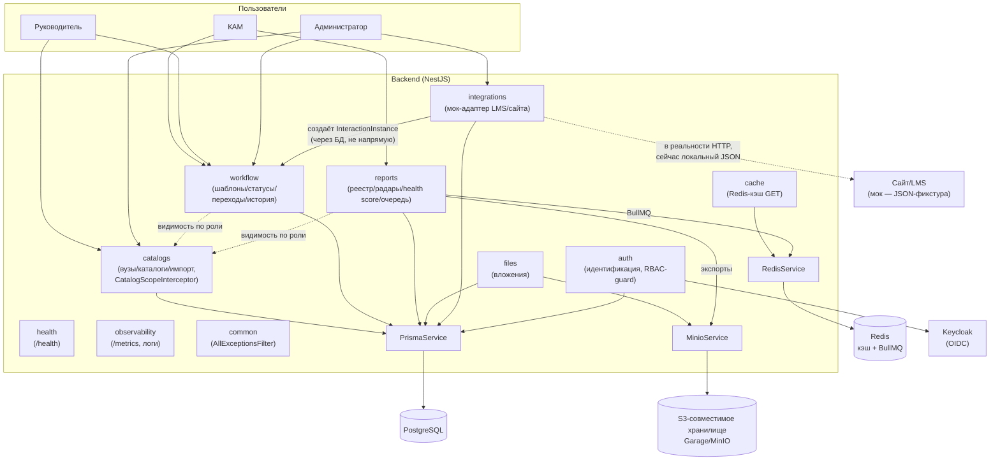

# Архитектура решения

Описывает CRM ИТ Школы РТК с двух сторон: функциональной (что система делает
для каждой роли и из чего состоит workflow) и компонентной (из каких модулей
состоит backend, как они связаны друг с другом и с внешними системами).
Пошаговый план разработки и полный список эндпоинтов — в
[docs/backend-plan.md](backend-plan.md); здесь — верхнеуровневая картина.

## 1. Функциональная архитектура

### 1.1 Роли и что каждая из них может

Три роли, вложенные друг в друга по зоне видимости (КАМ ⊂ команда
Руководителя ⊂ всё, что видит Администратор). RBAC проверяется на уровне
запроса (в сервисах, не только в контроллере/UI) — построчная видимость
данных считается один раз на запрос из `University.kamId` и роли текущего
пользователя (`CatalogScopeInterceptor`, переиспользуется каталогами,
workflow и отчётами).

| Роль | Видит | Может |
| --- | --- | --- |
| **КАМ** (~20 человек) | Только свои вузы (`University.kamId = я`) и взаимодействия по ним | Вести взаимодействие: создавать процесс, переводить по статусам, комментировать переход, прикладывать файл, точечно править заметку/ИТ-продукт своего взаимодействия |
| **Руководитель** | Все вузы своей команды КАМов (+ вузы без ответственного — они «ничьи», требуют внимания команды) | То же, что видит; переназначает ответственного КАМа за вуз/взаимодействие; **не** создаёт инстансы и не двигает статусы за КАМа (только просмотр процесса) |
| **Администратор** | Всё без ограничений | Каталоги (вузы, ИТ-направления/продукты, вендоры, ответственные лица, лицензии) — полный CRUD; workflow-шаблоны — создание/редактирование/версии; импорт xlsx; пользователи и роли; интеграции (мок LMS/сайта) — запуск синхронизации, маппинг курс→продукт |

### 1.2 Сквозные бизнес-функции

- **Каталоги и импорт.** Вузы, ИТ-направления, ИТ-продукты, вендоры,
  ответственные лица, лицензии/договоры — источник истины для всего
  остального. Импорт вузов из xlsx: пользователь маппит колонки файла на поля
  (`universityName`/`inn`/`region`/`website`), система показывает превью с
  классификацией каждой строки (`NEW` / `DUPLICATE_EXACT` /
  `DUPLICATE_FUZZY` — по похожести названия вуза), и только после
  подтверждения (`commit`) реально пишет в БД; нечёткие совпадения (`FUZZY`)
  никогда не применяются автоматически.
- **Workflow взаимодействия с вузом.** Ядро продукта — см. §1.3.
- **Файлы.** Вложения привязаны либо к взаимодействию в целом, либо к
  конкретному шагу его истории (например, подписанный договор при переходе в
  «Партнёрство»). Хранятся в S3-совместимом хранилище, ссылка на скачивание
  выдаётся временная (presigned URL), сам файл через backend не проксируется.
- **Отчёты.** Реестр взаимодействий с фильтрами (период, вуз, направление,
  продукт, ответственный, только просроченные), 2-3 графика для дашборда,
  экспорт в xls/xlsx/pdf — синхронно для небольших выборок или асинхронно
  через очередь (`POST /reports/jobs` → `GET /reports/export-status/{id}`)
  для больших/тяжёлых (PDF, полные радары).
- **Killer-фича — радар лицензий, SLA и health score.** Три виджета одного
  дашборда, посчитанные по одним и тем же данным (`License`,
  `StatusHistoryEntry`), без ML — простые правила по датам:
  - *Радар лицензий* — сколько лицензий истекает в окнах ≤7/≤30/≤60 дней или
    уже просрочены.
  - *Радар SLA* — какие взаимодействия зависли на текущем статусе дольше его
    норматива (`WorkflowStatus.slaDays`).
  - *Health score вуза* — свёртка обоих сигналов плюс застой активности и
    число заявок «требуют проверки» в единый цвет (`red`/`yellow`/`green`) и
    число 0–100 на вуз, с готовыми текстовыми причинами; веса и пороги
    вынесены в конфиг (`reports/health-score/health-score.config.ts`), чтобы
    их можно было быстро подстроить.
- **Интеграции (мок LMS/сайта).** См. §1.4 — отдельный ограниченный контур,
  не часть основного workflow-контракта.
- **Auth & RBAC.** Keycloak (OIDC) в проде; `AUTH_MODE=dev` — роль берётся из
  заголовка `X-Dev-Role` вместо реального логина (для демо/тестов).

### 1.3 Из чего состоит workflow

- **Шаблон (`WorkflowTemplate`)** — именованный процесс («Типовой цикл
  внедрения ИТ-продукта»). Правится Администратором.
- **Версия (`WorkflowTemplateVersion`)** — редактирование шаблона НЕ
  мутирует текущую версию, а создаёт новую (`isActive=true`), старую
  помечает `isActive=false`. Существующие взаимодействия остаются привязаны
  к своей версии и не переезжают на новую автоматически (кроме явного
  `migrateInstances=true` с явным переносом статусов по order).
- **Статус (`WorkflowStatus`)** — шаг процесса внутри версии: название,
  **одна из 7 CLM-макростадий** (`phase`: Инициация → Переговоры →
  Партнёрство → Внедрение → Обучение → Сопровождение → Завершение),
  порядковый номер, норматив SLA в днях (`slaDays`, опционален), минимальная
  длительность и зависимости от других статусов (для расчёта критического
  пути на фронте).
- **Переход (`WorkflowTransition`)** — разрешённое ребро графа «из статуса A
  в статус B» внутри версии. Это единственный источник истины «можно ли
  сделать такой переход» — `POST /workflow/instances/{id}/transition`
  всегда проверяется по этому графу (400, если перехода нет), и точечный
  `PATCH /workflow/instances/{id}` намеренно НЕ может менять статус в обход
  этой проверки (только заметку/ответственного/продукт).
- **Инстанс (`InteractionInstance`)** — конкретное взаимодействие с вузом,
  привязанное к вузу, ИТ-продукту, ответственному КАМу и **конкретной
  версии** шаблона. Может прийти двумя путями: вручную (`POST
  /workflow/instances`, КАМ/Админ) или из интеграции (`POST
  /integrations/sync`) — во втором случае `universityId`/`responsibleUserId`
  могут быть `null`, а `needsReview=true`, пока Руководитель/Админ не
  разберёт заявку вручную (`PATCH .../assignment`).
- **История (`StatusHistoryEntry`)** — append-only журнал переходов:
  из какого статуса в какой, кто, когда, комментарий, опциональное
  вложение. Ничего не перезаписывается и не удаляется — это и есть
  аудиторский след процесса.

### 1.4 Граница модуля-интеграции (мок LMS/сайта)

`integrations` — единственный модуль, который в проде говорил бы с внешней
системой (сайтом ИТ Школы/LMS), а сейчас читает статичную JSON-фикстуру
(`fixtures/integrations/orders.json`) вместо реального HTTP-вызова. Это
осознанно задокументированная граница мока, а не скрытая заглушка:

- **Вход:** «заявка» с полями *Номер заявки/Курс/ФИО/Телефон/Email/Номер
  потока* — реального контакта с вузом в ней физически нет, только курс.
- **Маппинг заявка → CRM:** курс резолвится в ИТ-направление/продукт через
  таблицу `CourseMapping` (Курс → ItDirection/ItProduct), которую ведёт
  Администратор; вуз **никогда не выводится автоматически** — заявка без
  разобранного курса помечается `needsReview=true` и ждёт ручного
  разбора Руководителем/Администратором.
- **Дедуп:** по `externalId` («Номер заявки») — повторный `sync` не создаёт
  дублей, только обновляет то, чего раньше не было (например, `itProductId`,
  если маппинг курса появился позже первого прогона).
- **Выход в основной домен:** синхронизация создаёт обычный
  `InteractionInstance` на активной версии активного шаблона — дальше он
  живёт по тем же правилам, что и вручную заведённый (переходы по графу,
  история, отчёты, радары). Модуль `integrations` после `sync` в дальнейшей
  жизни инстанса не участвует — это чистая граница «адаптер → домен», без
  двусторонней связи назад.

## 2. Компонентная архитектура

### 2.1 Модули backend (NestJS) и их роль

| Модуль | Controllers | Ключевые сервисы | Что делает |
| --- | --- | --- | --- |
| `catalogs` | `CatalogsController` | `CatalogsService`, `UniversityImportService`, `CatalogScopeInterceptor` | CRUD каталогов + импорт xlsx. `CatalogScopeInterceptor` — общий расчёт построчной видимости по роли, переиспользуется модулями `workflow` и `reports` |
| `workflow` | `WorkflowController` | `WorkflowService` | Шаблоны/версии/статусы/переходы, инстансы взаимодействий, append-only история. Единственное место, где проверяется граф переходов |
| `reports` | `ReportsController`, `DashboardController` | `ReportsService`, `ReportQueueService`, `HealthScoreService` | Реестр/графики/экспорт, радары лицензий/SLA, health score, асинхронная очередь отчётов |
| `files` | `FilesController` | `FilesService` | Загрузка/скачивание вложений через S3-совместимое хранилище (presigned URL) |
| `integrations` | `IntegrationsController` | `IntegrationsService` | Мок-адаптер LMS/сайта — см. §1.4 |
| `auth` | `AuthController`, `AdminController` | `AuthService`, `KeycloakJwtService`, `DevRoleGuard` | Идентификация (dev-заголовок или Keycloak JWT), управление пользователями/ролями, RBAC-guard на всех эндпоинтах |
| `health` | `HealthController` | `HealthService` | `GET /health` — по одному лёгкому пингу на Postgres/Redis/MinIO(+Keycloak) |
| `cache` | — | `AppCacheService`, `ReadCacheInterceptor`, `CacheInvalidationInterceptor` | Redis-кэш GET-эндпоинтов каталогов/дашборда по namespace, со сбросом по префиксу при любой записи в модуль |
| `observability` | `MetricsController` (Prometheus) | `HttpMetricsMiddleware`, structured-логи (pino) | `/metrics`, JSON-логи запросов с ролью/пользователем, без ПД в логах |
| `common` | — | `AllExceptionsFilter`, `error-codes.ts` | Единая форма ошибок `{code, message, details?}` на весь API |
| `prisma` / `redis` / `storage` | — | `PrismaService` / `RedisService` / `MinioService` | Тонкие обёртки над внешними зависимостями, `@Global()`-модули |

### 2.2 Связи между модулями

- `workflow` и `reports` **не дублируют** расчёт видимости — оба используют
  `CatalogScopeInterceptor` из `catalogs` (доменная граница по коду мягкая:
  `catalogs` — единственный источник правды про то, что значит «видимость
  по роли»).
- `reports.getHealthScore` переиспользует те же запросы, что радары лицензий
  и SLA (`licensesInScope`, `listInteractions`) — health score не заводит
  собственный путь выборки данных, а агрегирует то, что уже считают радары.
- `integrations` — единственный модуль, который создаёт `InteractionInstance`
  **не** через явный вызов КАМа/Админа, но пишет через тот же слой Prisma,
  что и `workflow` — никакого отдельного «теневого» домена нет.
- `files` независим от `workflow` на уровне кода (не импортирует его), но
  `StatusHistoryEntry.attachmentId` логически связывает шаг истории с
  конкретным файлом — связь через данные, не через DI.
- `AllExceptionsFilter` и `AppCacheModule`/`RedisModule`/`PrismaModule`/
  `MinioModule` подключены глобально в `AppModule` — все feature-модули
  получают их бесплатно, не объявляя зависимость явно.
- `DevRoleGuard` — единственный `APP_GUARD` на всё приложение; он же
  резолвит `currentUserId`, которым дальше пользуются `CatalogScopeInterceptor`
  и сервисы для RBAC-проверок внутри бизнес-логики (не только на входе).

### 2.3 Внешние зависимости

| Система | Кто использует | Зачем |
| --- | --- | --- |
| **PostgreSQL** | Все feature-модули (через Prisma) | Основное хранилище — единственный источник истины домена |
| **Redis** | `cache` (кэш GET-ответов), `reports` (очередь `BullMQ` для асинхронных отчётов) | Две независимые роли одного Redis: кэш и очередь заданий |
| **MinIO / S3-совместимое хранилище** (Garage в docker-compose) | `files` (вложения), `reports` (сгенерированные xlsx/pdf-экспорты) | Файлы никогда не хранятся в БД и не проксируются backend’ом — presigned URL напрямую из хранилища |
| **Keycloak (OIDC)** | `auth` (`KeycloakJwtService` — проверка JWT против realm) | Только при `AUTH_MODE=keycloak`; при `AUTH_MODE=dev` не задействован вовсе |
| **Внешний сайт/LMS (мок)** | `integrations` | В реальности — источник заявок; сейчас читает локальную JSON-фикстуру вместо HTTP-вызова, см. §1.4 |

## 3. Диаграмма компонентов

C4-подобная component-диаграмма (уровень Container/Component). Экспортирована
в двух форматах — возьмите тот, что удобнее для ручного переноса в Archi.

### 3.1 PlantUML (C4-Component)

```plantuml
@startuml crm-component-diagram
!include https://raw.githubusercontent.com/plantuml-stdlib/C4-PlantUML/master/C4_Component.puml

LAYOUT_WITH_LEGEND()
title CRM ИТ Школа РТК — диаграмма компонентов (backend)

Person(kam, "КАМ", "Ведёт взаимодействие со своими вузами")
Person(ruk, "Руководитель", "Видит команду, переназначает ответственных")
Person(admin, "Администратор", "Каталоги, шаблоны, пользователи, интеграции")

System_Ext(lms, "Сайт/LMS", "Внешний источник заявок (в проде)")
System_Ext(keycloak_ext, "Keycloak", "OIDC-провайдер")

System_Boundary(backend, "Backend (NestJS)") {

  Component(auth, "auth", "NestJS module", "Идентификация, роли, DevRoleGuard (APP_GUARD на всё приложение)")
  Component(catalogs, "catalogs", "NestJS module", "Вузы/направления/продукты/вендоры/лицензии, импорт xlsx, CatalogScopeInterceptor (видимость по роли)")
  Component(workflow, "workflow", "NestJS module", "Шаблоны/версии/статусы/переходы, инстансы, append-only история")
  Component(reports, "reports", "NestJS module", "Реестр, графики, экспорт, радары лицензий/SLA, health score, очередь отчётов")
  Component(files, "files", "NestJS module", "Загрузка/скачивание вложений (presigned URL)")
  Component(integrations, "integrations", "NestJS module", "Мок-адаптер LMS/сайта: заявки -> InteractionInstance, дедуп по externalId")
  Component(cache, "cache", "NestJS module", "Redis-кэш GET catalogs/dashboard, сброс по namespace при записи")
  Component(observability, "observability", "NestJS module", "/metrics (Prometheus), structured-логи (pino)")
  Component(common, "common", "NestJS module", "AllExceptionsFilter — единая форма ошибок {code, message, details?}")
  Component(health, "health", "NestJS module", "/health — пинг Postgres/Redis/MinIO(+Keycloak)")

  Component(prisma, "PrismaService", "Global provider", "Клиент PostgreSQL")
  Component(redisSvc, "RedisService", "Global provider", "Клиент Redis (ioredis)")
  Component(minio, "MinioService", "Global provider", "S3-совместимый клиент")
}

ContainerDb(postgres, "PostgreSQL", "БД", "Основное хранилище домена")
ContainerDb(redis, "Redis", "Кэш + очередь", "Кэш GET-ответов (cache) и очередь BullMQ (reports)")
ContainerDb(storage, "S3-совместимое хранилище", "Garage/MinIO", "Вложения + сгенерированные отчёты")

Rel(kam, workflow, "Создаёт/двигает взаимодействия", "HTTPS/REST")
Rel(kam, reports, "Смотрит свой реестр/радары", "HTTPS/REST")
Rel(ruk, workflow, "Просматривает команду", "HTTPS/REST")
Rel(ruk, catalogs, "Переназначает ответственного", "HTTPS/REST")
Rel(admin, catalogs, "Ведёт каталоги, импорт", "HTTPS/REST")
Rel(admin, workflow, "Редактирует шаблоны", "HTTPS/REST")
Rel(admin, integrations, "Запускает синхронизацию, ведёт course-mapping", "HTTPS/REST")

Rel(workflow, catalogs, "Использует CatalogScopeInterceptor (видимость по роли)", "in-process")
Rel(reports, catalogs, "Использует CatalogScopeInterceptor", "in-process")
Rel(integrations, workflow, "Создаёт InteractionInstance через тот же слой Prisma", "in-process, через БД")
Rel(reports, files, "Экспорты кладёт в то же хранилище, что вложения", "S3 API")

Rel(auth, keycloak_ext, "Проверяет JWT (AUTH_MODE=keycloak)", "HTTPS/OIDC")
Rel(integrations, lms, "В реальности: HTTP-запрос заявок\n(сейчас: локальная JSON-фикстура)", "HTTPS (мок)")

Rel(catalogs, prisma, "", "in-process")
Rel(workflow, prisma, "", "in-process")
Rel(reports, prisma, "", "in-process")
Rel(files, prisma, "", "in-process")
Rel(integrations, prisma, "", "in-process")
Rel(auth, prisma, "", "in-process")

Rel(prisma, postgres, "SQL", "TCP 5432")
Rel(cache, redisSvc, "", "in-process")
Rel(reports, redisSvc, "BullMQ (очередь отчётов)", "in-process")
Rel(redisSvc, redis, "", "TCP 6379")
Rel(files, minio, "", "in-process")
Rel(reports, minio, "Сгенерированные xlsx/pdf", "in-process")
Rel(minio, storage, "S3 API", "TCP 3900/443")

@enduml
```

### 3.2 Mermaid (эквивалент, для быстрого просмотра прямо в GitHub/README)


